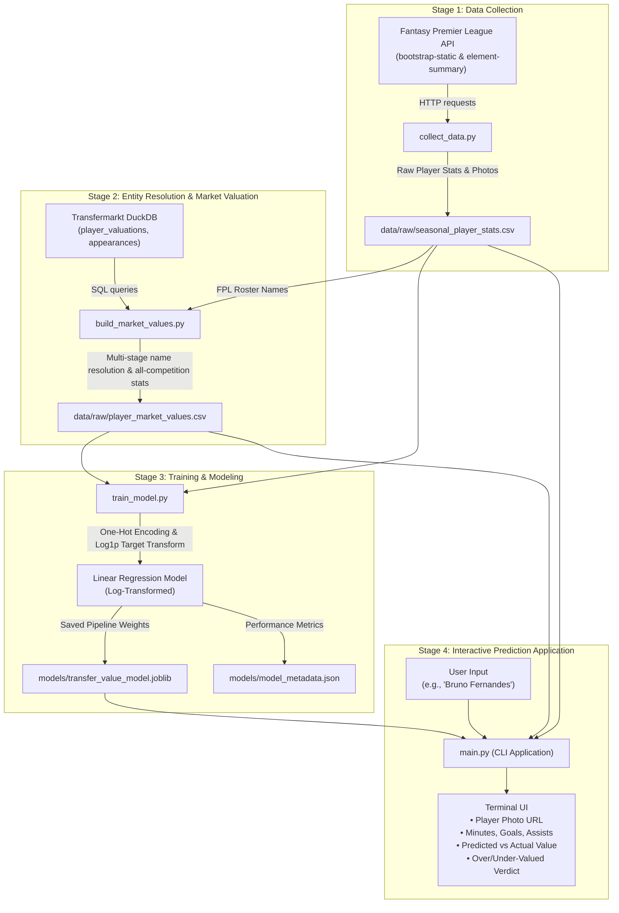

# System Architecture & Tech Stack

An accessible overview of how the **Premier League Transfer Market Value Predictor** works, designed for football analysts, club executives, product managers, and non-technical stakeholders, as well as software engineers.

---

## 1. Executive Summary: What Does This System Do?

In modern football, transfer fees and player valuations can appear arbitrary or driven by media hype. This application provides an **objective, data-backed baseline** for player transfer market values.

By collecting historical match performances across multiple Premier League seasons and pairing them with official transfer valuations, the system learns how playing time, goals, assists, position, and club affiliation statistically drive player valuations.

When a user searches for any Premier League player, the system:
1. Identifies the player and displays their official profile and photo.
2. Evaluates their match performance statistics from their latest completed season.
3. Produces an expected market value using a trained Machine Learning model.
4. Compares the predicted value against their actual market value to determine whether the player is **statistically overvalued, undervalued, or fairly priced**.

---

## 2. A Simple Analogy: How Does the System "Think"?

Imagine hiring an experienced football scout who has observed thousands of players over several seasons:
- When the scout sees a **forward** scoring 25 goals playing 3,000 minutes for Manchester City, they understand that output commands an elite price tag.
- When they see a **defender** at a mid-table club playing 1,500 minutes with 1 assist, they recognise a modest valuation bracket.

Our system does exactly this, but replaces subjective human intuition with **mathematical regression**. It looks at historical records of over 1,700 player-seasons, measures the statistical weight of every minute played, goal scored, assist provided, position held, and club represented, and generates a consistent market valuation.

```
       Input Facts                          Scout / Model Evaluation                       Output Result
┌───────────────────────────┐             ┌───────────────────────────┐             ┌───────────────────────────┐
│ Player: Erling Haaland    │             │ Checks:                   │             │ Predicted: £150M+         │
│ Position: Forward         │   ───────►  │ - Position: Forward      │   ───────►  │ Actual:    £155M          │
│ Club: Man City            │             │ - 38 appearances, 36 gls  │             │ Status: Fairly Valued     │
│ Output: 3,000+ mins, 36 g │             │ - Elite club premium      │             │                           │
└───────────────────────────┘             └───────────────────────────┘             └───────────────────────────┘
```

---

## 3. Technology Stack (Plain-English & Technical Guide)

| Tool / Technology | Plain-English Role | Technical Specification |
| :--- | :--- | :--- |
| **Python 3.12** | The engine powering the entire system | Core programming language for scripts, data pipelines, and CLI |
| **Fantasy Premier League (FPL) API** | Source for live player rosters, positions, and photos | REST JSON endpoints (`/bootstrap-static/` & `/element-summary/`) |
| **Transfermarkt Database** | Official historical market valuations and all-competition statistics | High-performance columnar DuckDB file (`transfermarkt-datasets.duckdb`) |
| **DuckDB** | Fast database engine to query large football datasets locally | In-process SQL OLAP engine querying player valuations and appearance logs |
| **Pandas & NumPy** | Data manipulation and cleaning workhorses | High-performance tabular transformation, fuzzy joining, and vectorised math |
| **Scikit-Learn** | Machine Learning algorithms and preprocessing pipelines | `LinearRegression`, `TransformedTargetRegressor`, `ColumnTransformer`, `OneHotEncoder` |
| **Joblib** | Safe storage and fast loading of trained model weights | Serialisation library saving model artifacts to disk for instant CLI inference |
| **Pytest** | Automated quality assurance | Unit testing suite verifying file integrity and dependencies |

---

## 4. End-to-End System Architecture

The pipeline consists of five stages operating in sequence:



---

## 5. Component Breakdown

### Component 1: Player Data Collection (`collect_data.py`)
- **What it does:** Reaches out over the internet to the Official Premier League fantasy API.
- **Why it matters:** It automatically detects the current active season (e.g. `2026-27`), downloads the complete Premier League roster (~600+ players), and fetches each player's historical seasonal appearances.
- **Bonus:** Retrieves high-resolution official Premier League headshot image URLs for every player.

### Component 2: Name Resolution & Valuation Builder (`build_market_values.py`)
- **The Core Challenge (Entity Resolution):** A player might be registered as `"Bruno Fernandes"` in FPL, but recorded as `"Bruno Miguel Borges Fernandes"` in the Transfermarkt database. Diacritics (accents), abbreviations, and name particles (`de`, `da`, `dos`, `van`) cause simple searches to fail.
- **The Solution:** A 4-stage matching algorithm:
  1. **Unicode Normalisation:** Strips accents and lowercase-converts strings (e.g. `Rúben` ➔ `ruben`).
  2. **Particle Removal:** Removes connecting words like `de`, `van`, `bin`.
  3. **First-Last Token Matching:** Matches `"bruno fernandes"` to `"bruno ... fernandes"`.
  4. **Token Subset Fallback:** Tests if query tokens form a complete subset of the database entry.
- **Stat Aggregation:** Computes season-end market valuations in GBP and sums all-competition minutes, goals, and assists (including Champions League and domestic cups).

### Component 3: Training Pipeline (`train_model.py`)
- **Clean Split:** Strictly isolates historical completed seasons for training. In-progress seasons are excluded from training to prevent data leakage.
- **The Logarithmic Secret (`log1p`):**
  - In football, a £100M superstar is not simply 10 times better than a £10M player; values escalate exponentially at the top tier.
  - If a model predicts raw pound values directly, extreme outliers (e.g., Haaland or Salah) pull the entire regression line out of balance, producing negative predictions for squad players.
  - By transforming market value to `log(1 + value)`, the relationship becomes linear and well-behaved. The model predicts in log-space and exponentiates back to real GBP for presentation.
- **Metrics Tracked:**
  - **MAE (Mean Absolute Error):** £8.75M average error margin.
  - **RMSE (Root Mean Squared Error):** £13.74M.
  - **R² Score:** 0.438 (explains ~44% of historical valuation variance purely from basic box-score metrics).

### Component 4: Prediction & Search Interface (`main.py`)
- **Instant Response:** The model is pre-trained and saved in `models/`. Searching for a player loads the cached weights in milliseconds without retraining.
- **Flexible Search:** Users can type full names, partial names, or names without accents (e.g., `"Odegaard"` or `"Martin Odegaard"`). If ambiguous (e.g., searching `"Silva"`), the CLI presents an interactive numbered selection.
- **Valuation Insight:** Computes the delta:
  $$\text{Difference} = \text{Predicted Value} - \text{Actual Value}$$
  A positive difference signals an undervalued asset or an overperforming player relative to their price tag; a negative difference indicates a player whose commercial market value exceeds their raw box-score statistics.

---

## 6. What Makes Player Values Hard to Predict? (Model Boundaries)

The model performs exceptionally well as a statistical baseline, but transfer values are driven by real-world context outside match statistics:

```
┌────────────────────────────────────────────────────────────────────────┐
│                        TRANSFER VALUE DRIVERS                          │
├───────────────────────────────────┬────────────────────────────────────┤
│   Captured by This Model          │   Real-World Context (Uncaptured)  │
├───────────────────────────────────┼────────────────────────────────────┤
│ ✓ Goals and Assists               │ ✗ Contract Duration Remaining      │
│ ✓ Total Minutes and Appearances   │ ✗ Release Clauses                  │
│ ✓ On-pitch Position               │ ✗ Player Age & Career Trajectory   │
│ ✓ Club Affiliation / Pedigree     │ ✗ Injury & Medical History         │
│ ✓ All-competition consistency     │ ✗ Commercial & Marketing Appeal    │
│                                   │ ✗ Tactical Defensive Actions       │
└───────────────────────────────────┴────────────────────────────────────┘
```

**Takeaway:** This system is an analytical decision-support tool. It measures what a player's raw output is worth on average across the league, helping scouts and enthusiasts spot statistical anomalies and market inefficiencies.
