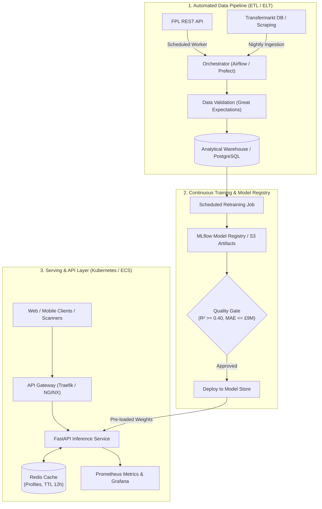

# Production Engineering & MLOps Blueprint

A comprehensive engineering guide for transitioning the **Premier League Transfer Market Value Predictor** from a local CLI application to an enterprise-grade, high-availability production service.

---

## 1. System Architecture in Production

In a production environment, the single-machine CLI workflow is decoupled into three primary tiers:



---

## 2. Ingestion & Pipeline Orchestration

### 2.1 Scheduled Orchestration (Apache Airflow / Prefect)
- **Schedule:**
  - **Matchday Updates (Weekly):** Pull updated minutes, goals, assists every Monday at 02:00 UTC.
  - **Valuation Sync (Transfer Window):** Transfer valuations fluctuate heavily in January and July/August. Run market value synchronization twice weekly during transfer windows, and bi-weekly during the season.
- **Resilience & Rate Limiting:**
  - Implement token-bucket rate limiters when querying external APIs (`tenacity` exponential backoff with jitter).
  - Cache raw JSON payloads in AWS S3 or GCP Cloud Storage with date partitioning (`s3://data-lake/fpl/raw/YYYY/MM/DD/`).
- **Data Quality Gates:**
  - Schema assertion using **Pydantic** or **Great Expectations** before committing to storage:
    - `player_id` must be non-null and unique per season.
    - `total_minutes >= 0` and `total_appearances >= 0`.
    - `market_value_gbp > 0`.

---

## 3. MLOps: Model Lifecycle & Governance

### 3.1 Model Registry & Versioning
- Eliminate unversioned local `.joblib` files on disk. Use **MLflow** or **Weights & Biases**:
  ```python
  import mlflow
  import mlflow.sklearn

  with mlflow.start_run(run_name="linear_regression_log1p"):
      mlflow.log_params({"model": "LinearRegression", "target_transform": "log1p"})
      mlflow.log_metrics({"mae_gbp": mae, "rmse_gbp": rmse, "r2": r2})
      mlflow.sklearn.log_model(
          sk_model=model,
          artifact_path="model",
          registered_model_name="pl_transfer_value_predictor",
      )
  ```
- Models must progress through staged tags: `Development` ➔ `Staging` ➔ `Production`.

### 3.2 Drift Detection (Data & Concept Drift)
- **Feature Drift:** Compare the distribution of incoming inference requests against training distributions using Kolmogorov-Smirnov tests or Population Stability Index (PSI) via **Evidently AI**.
- **Model Drift:** As inflation in football transfer fees continues (e.g. rising median fees per window), evaluate residual trends. If mean residual exceeds threshold $\pm 10\%$, trigger an automated retraining event.

---

## 4. Serving Architecture: FastAPI REST Microservice

To serve high-concurrency requests, replace `main.py` CLI with an asynchronous **FastAPI** service:

### 4.1 Production API Implementation Pattern
```python
# app/api/routes.py
from fastapi import APIRouter, HTTPException, Depends
from pydantic import BaseModel, Field
import joblib

router = APIRouter(prefix="/v1/predictions", tags=["Predictions"])

class PlayerPredictionRequest(BaseModel):
    total_minutes: float = Field(..., ge=0, example=2800)
    total_appearances: float = Field(..., ge=0, example=35)
    total_goals: float = Field(..., ge=0, example=18)
    total_assists: float = Field(..., ge=0, example=9)
    position: str = Field(..., example="Forward")
    team: str = Field(..., example="Arsenal")

class PlayerPredictionResponse(BaseModel):
    predicted_market_value_gbp: float
    formatted_value: str
    model_version: str

@router.post("/evaluate", response_model=PlayerPredictionResponse)
async def evaluate_player(payload: PlayerPredictionRequest, model = Depends(get_loaded_model)):
    try:
        import pandas as pd
        df = pd.DataFrame([payload.model_dump()])
        pred = max(float(model.predict(df)[0]), 0.0)
        return PlayerPredictionResponse(
            predicted_market_value_gbp=pred,
            formatted_value=f"£{pred/1e6:.2f}M",
            model_version="1.2.0"
        )
    except Exception as exc:
        raise HTTPException(status_code=500, detail=str(exc))
```

### 4.2 Caching Strategy (Redis)
- Store resolved player entity lookups and static profile predictions in Redis with a 12-hour Time-To-Live (TTL):
  - Key format: `player:pred:{fpl_id}:{season}`
  - Typical cache hit ratio in sports apps is > 85% for prominent players.
  - Reduces inference latency from ~15ms to < 2ms.

---

## 5. Containerization & Deployment

### 5.1 Production Dockerfile
```dockerfile
# Multi-stage build for minimal image footprint
FROM python:3.12-slim AS builder

WORKDIR /app
RUN apt-get update && apt-get install -y --no-install-recommends build-essential && rm -rf /var/lib/apt/lists/*
COPY requirements.txt .
RUN pip install --no-cache-dir --user -r requirements.txt

FROM python:3.12-slim AS runner

WORKDIR /app
COPY --from=builder /root/.local /root/.local
ENV PATH=/root/.local/bin:$PATH

# Copy application code and model artifacts
COPY src/ ./src/
COPY models/ ./models/
COPY app/ ./app/

EXPOSE 8000
USER 1001

CMD ["uvicorn", "app.main:app", "--host", "0.0.0.0", "--port", "8000", "--workers", "4"]
```

### 5.2 Kubernetes Deployment Manifest
```yaml
apiVersion: apps/v1
kind: Deployment
metadata:
  name: transfer-value-predictor
  namespace: ml-services
spec:
  replicas: 3
  selector:
    matchLabels:
      app: transfer-value-predictor
  template:
    metadata:
      labels:
        app: transfer-value-predictor
    spec:
      containers:
      - name: predictor
        image: gcr.io/football-analytics/transfer-predictor:v1.2.0
        ports:
        - containerPort: 8000
        resources:
          limits:
            cpu: "1000m"
            memory: "1Gi"
          requests:
            cpu: "250m"
            memory: "512Mi"
        livenessProbe:
          httpGet:
            path: /health
            port: 8000
          initialDelaySeconds: 5
          periodSeconds: 10
        readinessProbe:
          httpGet:
            path: /ready
            port: 8000
          initialDelaySeconds: 2
          periodSeconds: 5
```

---

## 6. Telemetry, Observability & Alerting

| Metric | Tool | Normal Threshold | Alerting Condition |
| :--- | :--- | :--- | :--- |
| **P95 Latency** | Prometheus / Grafana | < 25 ms | P95 > 100 ms for 5 mins |
| **Error Rate (5xx)** | Datadog / Prometheus | 0.00% | > 0.5% in 1 minute window |
| **Unmatched Entity Ratio** | Custom App Metric | < 5% | > 15% of queries unmapped |
| **Model Invalidation** | Scheduled Evaluation | $R^2 \ge 0.40$ | $R^2 < 0.35$ triggers retraining alert |

---

## 7. Security & Compliance
- **Authentication:** Enforce JWT / OAuth2 token verification on incoming requests via Kong or Cloudflare API Gateway.
- **Data Protection:** No Personal Identifiable Information (PII) of end-users is recorded; only public sports statistics are utilized.
- **Vulnerability Scanning:** Automated container vulnerability scanning using Trivy or Snyk in CI/CD pipeline prior to registry pushes.
